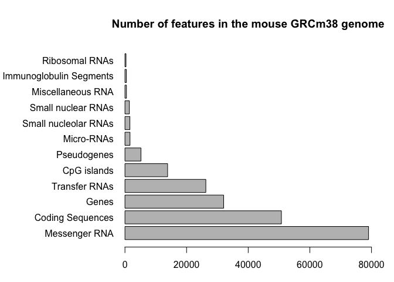
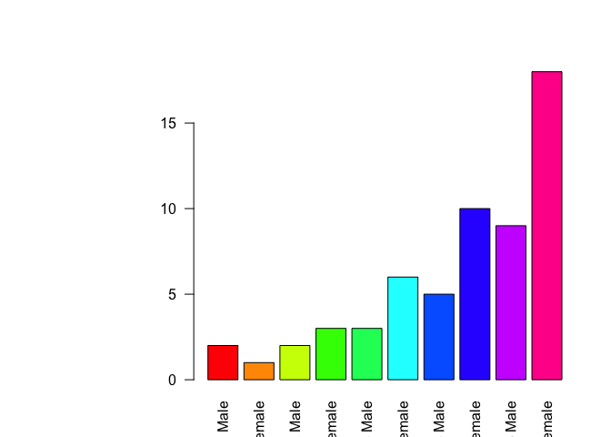

Class 05
================
shuyiwang
Thu Nov 1 11:51:12 2018

This is **regular text** that we could have Rmd documet

``` r
# Baby weight with age
weight<- read.table("bimm143_05_rstats/weight_chart.txt", header = TRUE)

plot(weight,typ="b",pch=15,cex=1.5,lwd=2,ylim=c(2,10),xlab="Age (months)",ylab="Weight (kg)")
```


``` r
counts<- read.table("bimm143_05_rstats/feature_counts.txt", header= TRUE, sep = "\t")

counts$Count
```

    ##  [1] 79049 50770 32029 26248 13840  5195  1638  1602  1431   491   474
    ## [12]   341

``` r
barplot(counts$Count, names.arg = counts$Feature, horiz=TRUE, las=1, main="Number of features in the mouse GRCm38 genome")
```


``` r
par(mar=c(3.1, 11.1, 4.1, 2))
barplot(counts$Count, names.arg=counts$Feature, horiz=TRUE, ylab="", main="Number of features in the mouse GRCm38 genome", las=1, xlim=c(0,80000))
```



``` r
#2c histograms
x<- c(rnorm(10000), rnorm(10000)+4)
hist(x, breaks = 10)
```


``` r
hist(c(rnorm(10000), rnorm(10000)+4), main = "breaks default")
```


``` r
hist(c(rnorm(10000), rnorm(10000)+4), breaks = 30)
```


``` r
hist(c(rnorm(10000), rnorm(10000)+4), breaks = 30, main= "Histogram of x", xlab = "x")
```


``` r
plot( 1:10, pch=1:5, cex=1:5)
```


``` r
plot( 1:10, pch=1:5, cex=1:5, col=c("red","blue","green"))
```


``` r
plot(c(1:10)^2, typ="b", lwd=4, lty=3)
```


``` r
boxplot(cbind(rnorm(1000,0),rnorm(10000,4)))
```


``` r
male <-read.table("bimm143_05_rstats/male_female_counts.txt", header = TRUE, sep = "\t")
barplot (male$Count, names.arg = male$Sample, col=rainbow(nrow(male)), las= 2)
```



``` r
genes <- read.table("bimm143_05_rstats/up_down_expression.txt", header= TRUE, sep = "\t")

#How many are up, down and all around?
table(genes$State)
```

    ## 
    ##       down unchanging         up 
    ##         72       4997        127

``` r
#let plot this data
plot(genes$Condition1, genes$Condition2, col=genes$State)
```


``` r
meth<- read.table("bimm143_05_rstats/expression_methylation.txt", header = TRUE, sep = "\t" )
plot(meth$gene.meth, meth$expression)
```


``` r
dcol<- densCols(meth$gene.meth, meth$expression)
plot(meth$gene.meth, meth$expression, col=dcol, pch=20)
```


``` r
inds<- meth$expression > 0
mycols2<- densCols(meth$gene.meth[inds], meth$expression[inds])
plot(meth$gene.meth[inds], meth$expression[inds], col=mycols2)
```


