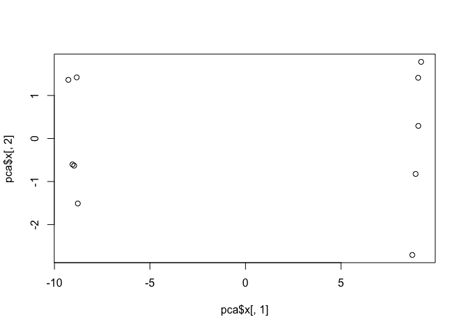

Class 08
================

K-means clusterig
-----------------

Our first example with **kmeans()** function.

``` r
# Example plot to see how Rmarkdown works
plot(1:10, typ = "l")
```


Back to kmeans

``` r
# Generate some example data for clustering
tmp <- c(rnorm(30,-3), rnorm(30,3))
x <- cbind(x=tmp, y=rev(tmp))
plot(x)
```


``` r
k <- kmeans(x, centers = 2, nstart = 20 )
k
```

    ## K-means clustering with 2 clusters of sizes 30, 30
    ## 
    ## Cluster means:
    ##           x         y
    ## 1  3.030365 -3.111300
    ## 2 -3.111300  3.030365
    ## 
    ## Clustering vector:
    ##  [1] 2 2 2 2 2 2 2 2 2 2 2 2 2 2 2 2 2 2 2 2 2 2 2 2 2 2 2 2 2 2 1 1 1 1 1
    ## [36] 1 1 1 1 1 1 1 1 1 1 1 1 1 1 1 1 1 1 1 1 1 1 1 1 1
    ## 
    ## Within cluster sum of squares by cluster:
    ## [1] 46.20741 46.20741
    ##  (between_SS / total_SS =  92.4 %)
    ## 
    ## Available components:
    ## 
    ## [1] "cluster"      "centers"      "totss"        "withinss"    
    ## [5] "tot.withinss" "betweenss"    "size"         "iter"        
    ## [9] "ifault"

Use the kmeans() function setting k to 2 and nstart=20

Inspect/print the results Q. How many points are in each cluster?

``` r
k$size
```

    ## [1] 30 30

Q. What ‘component’ of your result object details - cluster size? 'k$size' - cluster assignment/membership? - cluster center?

``` r
k$cluster
```

    ##  [1] 2 2 2 2 2 2 2 2 2 2 2 2 2 2 2 2 2 2 2 2 2 2 2 2 2 2 2 2 2 2 1 1 1 1 1
    ## [36] 1 1 1 1 1 1 1 1 1 1 1 1 1 1 1 1 1 1 1 1 1 1 1 1 1

``` r
table(k$cluster)
```

    ## 
    ##  1  2 
    ## 30 30

``` r
k$centers
```

    ##           x         y
    ## 1  3.030365 -3.111300
    ## 2 -3.111300  3.030365

Plot x colored by the kmeans cluster assignment and add cluster centers as blue points

``` r
plot(x, col = k$cluster)
palette(c("blue", "red"))
points(k$centers, col = "green", pch = 20, cex = 3)
```


Q. Repeat for k=3, which has the lower tot.withinss?

``` r
k2 <- kmeans(x, centers = 2, nstart = 20)
k3 <- kmeans(x, centers = 3, nstart = 20)
k4 <- kmeans(x, centers = 4, nstart = 20)
k5 <- kmeans(x, centers = 5, nstart = 20)

k2$tot.withinss
```

    ## [1] 92.41481

``` r
k3$tot.withinss
```

    ## [1] 71.5635

``` r
k4$tot.withinss
```

    ## [1] 50.71218

``` r
k5$tot.withinss
```

    ## [1] 42.25637

``` r
plot(c(k2$tot.withinss,k3$tot.withinss, k4$tot.withinss, k5$tot.withinss), typ = "b")
```


Hierarchical clustering in R
----------------------------

Let's try out the **hclust()** function for Hierarchical clustering in R. This function need a distance matrix as input!

``` r
d <- dist(x)
hc <- hclust(d)
plot(hc)
```


``` r
plot(hc)
# Draw a line on the dendrogram
abline(h=8, col="red")
```


``` r
# Cut the tree to yield cuter membership vector
cutree(hc, h=8)
```

    ##  [1] 1 1 1 1 1 1 1 1 1 1 1 1 1 1 1 1 1 1 1 1 1 1 1 1 1 1 1 1 1 1 2 2 2 2 2
    ## [36] 2 2 2 2 2 2 2 2 2 2 2 2 2 2 2 2 2 2 2 2 2 2 2 2 2

``` r
cutree(hc, k=2)
```

    ##  [1] 1 1 1 1 1 1 1 1 1 1 1 1 1 1 1 1 1 1 1 1 1 1 1 1 1 1 1 1 1 1 2 2 2 2 2
    ## [36] 2 2 2 2 2 2 2 2 2 2 2 2 2 2 2 2 2 2 2 2 2 2 2 2 2

### A more "real"example of data clusting

``` r
# Step 1. Generate some example data for clustering
x <- rbind(
 matrix(rnorm(100, mean=0, sd = 0.3), ncol = 2), # c1
 matrix(rnorm(100, mean = 1, sd = 0.3), ncol = 2), # c2
 matrix(c(rnorm(50, mean = 1, sd = 0.3), # c3
 rnorm(50, mean = 0, sd = 0.3)), ncol = 2))
colnames(x) <- c("x", "y")

# Step 2. Plot the data without clustering
plot(x)
```


``` r
# Step 3. Generate colors for known clusters
# (just so we can compare to hclust results)
col <- as.factor( rep(c("c1","c2","c3"), each=50) )

grp.names <- rep(c("red", "blue", "black"), each=50)

palette(c("red", "blue", "black"))
plot(x, col=grp.names, pch=20)
```


Q. Use the dist(), hclust(), plot() and cutree() functions to return 2 and 3 clusters

``` r
d <- dist(x)
hc <- hclust(d)
plot(hc)
```


``` r
grp.2 <- cutree(hc, k=2)
grp.3 <-cutree(hc, k=3)

plot(x, col=grp.3, pch=20)
```


Q. How does this compare to your known 'col' groups?

``` r
# Use the table() function!!
table(grp.3, col)
```

    ##      col
    ## grp.3 c1 c2 c3
    ##     1 47  0  5
    ##     2  3 48 10
    ##     3  0  2 35

#### Principle component analysis (PCA)

Let's make up some data with quite a few dimensions

``` r
## Initialize a blank 100 row by 10 column matrix
mydata <- matrix(nrow=100, ncol=10)

## Lets label the rows gene1, gene2 etc. to gene100
rownames(mydata) <- paste("gene", 1:100, sep="")

## Lets label the first 5 columns wt1, wt2, wt3, wt4 and wt5
## and the last 5 ko1, ko2 etc. to ko5 (for "knock-out")
colnames(mydata) <- c( paste("wt", 1:5, sep=""),
 paste("ko", 1:5, sep="") )

## Fill in some fake read counts
for(i in 1:nrow(mydata)) {
 wt.values <- rpois(5, lambda=sample(x=10:1000, size=1))
 ko.values <- rpois(5, lambda=sample(x=10:1000, size=1))

 mydata[i,] <- c(wt.values, ko.values)
}

head(mydata)
```

    ##       wt1 wt2 wt3 wt4 wt5 ko1 ko2 ko3 ko4 ko5
    ## gene1 894 793 849 906 858 220 217 185 204 234
    ## gene2 387 381 439 385 380 434 426 424 454 445
    ## gene3 852 852 819 870 837 776 761 790 789 807
    ## gene4 842 839 795 874 867 227 216 249 237 215
    ## gene5 352 361 356 337 346 745 745 769 754 752
    ## gene6 637 570 561 572 608 273 304 299 281 307

Note the prcomp()
=================

``` r
head(t(mydata))
```

    ##     gene1 gene2 gene3 gene4 gene5 gene6 gene7 gene8 gene9 gene10 gene11
    ## wt1   894   387   852   842   352   637  1013   630   409    104    523
    ## wt2   793   381   852   839   361   570   970   601   414     96    494
    ## wt3   849   439   819   795   356   561   918   601   465     95    513
    ## wt4   906   385   870   874   337   572   901   619   381    110    497
    ## wt5   858   380   837   867   346   608   931   589   443    107    520
    ## ko1   220   434   776   227   745   273   741   969   605    758    727
    ##     gene12 gene13 gene14 gene15 gene16 gene17 gene18 gene19 gene20 gene21
    ## wt1    583    624    437    819    911    441     58    274    404    604
    ## wt2    577    569    455    771    925    465     54    322    431    613
    ## wt3    595    654    430    789    999    463     43    296    398    601
    ## wt4    636    600    458    795    948    413     56    321    438    613
    ## wt5    562    632    444    847    898    447     40    304    446    612
    ## ko1     33   1040    561   1010    355    755    750    832    701    877
    ##     gene22 gene23 gene24 gene25 gene26 gene27 gene28 gene29 gene30 gene31
    ## wt1    696    373    670     43    763    830    592    376    283     36
    ## wt2    648    350    611     37    719    850    588    372    326     29
    ## wt3    645    366    640     33    736    793    611    349    309     32
    ## wt4    670    369    651     37    676    840    650    385    319     27
    ## wt5    661    348    649     34    707    813    650    371    292     27
    ## ko1    226    772    657    967     83    479    822    124    794    622
    ##     gene32 gene33 gene34 gene35 gene36 gene37 gene38 gene39 gene40 gene41
    ## wt1    639    897    773    234     65    493    697    519    986    942
    ## wt2    622    838    804    244     53    496    699    540    972    944
    ## wt3    669    847    781    225     60    483    613    505   1039    986
    ## wt4    620    867    706    215     87    514    653    549   1048    927
    ## wt5    652    850    757    224     67    468    683    548    953    905
    ## ko1    645    853    861    919    657     68    709     26    207    521
    ##     gene42 gene43 gene44 gene45 gene46 gene47 gene48 gene49 gene50 gene51
    ## wt1    168    291    372    730    158   1048    875    181   1024    121
    ## wt2    168    315    372    684    114    943    867    167   1010    118
    ## wt3    168    338    353    656    116    925    887    160    969    116
    ## wt4    188    334    361    657    134    979    939    165    993    132
    ## wt5    181    304    350    720    107    981    887    166    984    126
    ## ko1    882    322     85    282    565    771    708    754    839    329
    ##     gene52 gene53 gene54 gene55 gene56 gene57 gene58 gene59 gene60 gene61
    ## wt1    257    492    951    456    898    439    320    985    311    580
    ## wt2    240    538    925    450    821    451    285    987    286    576
    ## wt3    269    524    942    452    833    441    280   1008    314    576
    ## wt4    237    510    925    413    850    477    294   1012    310    595
    ## wt5    288    516    960    431    840    447    314    957    311    597
    ## ko1    844    915    564    703    169    224    774    991    103    911
    ##     gene62 gene63 gene64 gene65 gene66 gene67 gene68 gene69 gene70 gene71
    ## wt1    140    404    774    343    506    697    780    428    562    620
    ## wt2    143    386    722    368    556    741    767    422    525    617
    ## wt3    112    417    768    331    568    703    769    382    509    622
    ## wt4    120    403    764    333    546    699    765    411    507    621
    ## wt5    105    408    747    332    528    707    776    391    532    648
    ## ko1    848    335     43    377    374    914    995    935    226    183
    ##     gene72 gene73 gene74 gene75 gene76 gene77 gene78 gene79 gene80 gene81
    ## wt1    383    222    968    468    568    632    192    112    681    788
    ## wt2    372    204    973    468    541    604    184    151    662    761
    ## wt3    374    205    942    506    581    596    208    117    691    790
    ## wt4    381    224    969    492    546    601    163    132    657    792
    ## wt5    403    226    976    502    554    584    181    130    660    758
    ## ko1    961    540    763    967    933    958    136    204    625    447
    ##     gene82 gene83 gene84 gene85 gene86 gene87 gene88 gene89 gene90 gene91
    ## wt1    880    581    797    575    634    741    269    468    415    260
    ## wt2    866    585    807    538    672    747    239    516    445    307
    ## wt3    893    585    800    516    650    742    265    528    427    281
    ## wt4    889    581    768    551    713    821    259    486    420    253
    ## wt5    919    602    744    532    662    719    226    474    441    256
    ## ko1    908    323    178    645    341    895    400    662     86    187
    ##     gene92 gene93 gene94 gene95 gene96 gene97 gene98 gene99 gene100
    ## wt1    285    492    960    567    470    608    508    769     611
    ## wt2    298    536    950    563    473    619    494    826     557
    ## wt3    296    558    967    528    487    585    484    793     577
    ## wt4    264    572   1005    513    470    580    501    782     599
    ## wt5    272    533    975    514    527    607    526    812     636
    ## ko1    792    660    144    448    958    485     15    918      67

Now lets try to find "structure"" in this data with **prcomp)**

``` r
## lets do PCA
pca <- prcomp(t(mydata), scale=TRUE) 
pca
```

    ## Standard deviations (1, .., p=10):
    ##  [1] 9.469168e+00 1.497553e+00 1.446092e+00 1.350008e+00 1.240768e+00
    ##  [6] 1.032887e+00 7.896215e-01 7.558617e-01 6.142399e-01 3.397905e-15
    ## 
    ## Rotation (n x k) = (100 x 10):
    ##                  PC1           PC2           PC3           PC4
    ## gene1   -0.105147634  0.0183456885 -0.0025187048 -0.0222058147
    ## gene2    0.081441300 -0.0077337644  0.2977050118 -0.2563964677
    ## gene3   -0.093377123  0.1575466488 -0.1816633029 -0.0176034183
    ## gene4   -0.105337035  0.0193591675 -0.0087648330  0.0126706263
    ## gene5    0.105490028 -0.0049291803 -0.0112711959  0.0052520044
    ## gene6   -0.104581998  0.0398814452 -0.0413687641  0.0196059144
    ## gene7   -0.101313683  0.0267991122 -0.0634368907  0.1231433492
    ## gene8    0.105099318 -0.0120607044 -0.0144543320  0.0326319357
    ## gene9    0.102034336 -0.0880881117  0.0381051880 -0.0317657787
    ## gene10   0.105563327  0.0038045422 -0.0057442282  0.0085316239
    ## gene11   0.103780097  0.0586931193 -0.0236440869 -0.0453280079
    ## gene12  -0.105338451 -0.0050794619 -0.0034412126 -0.0274496274
    ## gene13   0.104814632  0.0092232962  0.0303892246 -0.0297003291
    ## gene14   0.099722199  0.1510255534 -0.0083193831 -0.0282111758
    ## gene15   0.101216061  0.1331984319 -0.0499477659 -0.0816491428
    ## gene16  -0.105131509 -0.0257797371  0.0272252515 -0.0494794498
    ## gene17   0.103498231  0.0106720258  0.0957196435  0.0802915912
    ## gene18   0.105426931 -0.0016337733 -0.0013637749  0.0235254495
    ## gene19   0.105217019 -0.0299190610 -0.0088055637  0.0180930036
    ## gene20   0.104721184  0.0290372473 -0.0383238103 -0.0033938974
    ## gene21   0.104290264 -0.0248396983 -0.0822274363 -0.0404131110
    ## gene22  -0.105349477  0.0339398897 -0.0187003638 -0.0081896347
    ## gene23   0.105008664 -0.0284910315  0.0182748770  0.0498289070
    ## gene24   0.067556240  0.2856576109 -0.0217197454 -0.0672066600
    ## gene25   0.105538539  0.0082451133 -0.0065589568  0.0078443812
    ## gene26  -0.105391402  0.0143331723  0.0151501449  0.0002948078
    ## gene27  -0.104849393 -0.0281494509 -0.0701482422  0.0135780332
    ## gene28   0.102500056  0.0494707340  0.0299817348 -0.0376313284
    ## gene29  -0.105223773  0.0227282350  0.0008736668  0.0369621817
    ## gene30   0.105321958  0.0183609232  0.0083403152 -0.0031459494
    ## gene31   0.105317023 -0.0162556865 -0.0118643901  0.0088639770
    ## gene32   0.058106505 -0.0658094442  0.4141508810 -0.0655683551
    ## gene33   0.044941323  0.1882581857 -0.3858003949 -0.1429564853
    ## gene34   0.087174561 -0.0027013410 -0.1658700713 -0.1485189837
    ## gene35   0.105410011  0.0118340904 -0.0205690778 -0.0020842341
    ## gene36   0.105459790 -0.0078386706  0.0031456094  0.0238538088
    ## gene37  -0.105485075 -0.0138438673 -0.0097738220  0.0006152280
    ## gene38   0.055760311  0.3027081026 -0.3818943134  0.2407002171
    ## gene39  -0.105448576  0.0104004199  0.0008798125  0.0089520087
    ## gene40  -0.105260588 -0.0142967937  0.0200003763 -0.0249973431
    ## gene41  -0.104992685 -0.0120397447  0.0065877290 -0.0605465720
    ## gene42   0.105453934  0.0203693957 -0.0043307419 -0.0081934633
    ## gene43  -0.001443318 -0.3334070105 -0.2084004300 -0.5486620138
    ## gene44  -0.105516554 -0.0029545955 -0.0189585513  0.0069748383
    ## gene45  -0.104957029  0.0608504523 -0.0055285820  0.0228660823
    ## gene46   0.105127609  0.0316834886 -0.0363304737 -0.0124982618
    ## gene47  -0.100967486  0.0897656036 -0.1182600972  0.0408363985
    ## gene48  -0.103245788 -0.0323087644 -0.0320797004 -0.0616484227
    ## gene49   0.105401098 -0.0128332445 -0.0023798753  0.0355341032
    ## gene50  -0.099581150 -0.0422822062 -0.1979708527 -0.0040973041
    ## gene51   0.104889313  0.0024742949 -0.0208595803 -0.0040421823
    ## gene52   0.105503761  0.0065381196  0.0025126155 -0.0033583828
    ## gene53   0.104905476 -0.0058431816  0.0529059052  0.0476454315
    ## gene54  -0.105063963  0.0397213193  0.0037695707 -0.0285501112
    ## gene55   0.103753564  0.0507887041  0.0634798814  0.0329430841
    ## gene56  -0.105478595  0.0142830181 -0.0054756351 -0.0001774869
    ## gene57  -0.104869828 -0.0048768653  0.0265289584  0.0278648425
    ## gene58   0.105145578 -0.0048389964 -0.0476850773 -0.0002427798
    ## gene59   0.041468299 -0.5108544548 -0.2142172300 -0.0205646672
    ## gene60  -0.105047214  0.0125741392  0.0435688312 -0.0068195175
    ## gene61   0.105397732  0.0211423044 -0.0050932829  0.0022170512
    ## gene62   0.105287638 -0.0009375001 -0.0398959773 -0.0014177410
    ## gene63  -0.103179629 -0.0323132306  0.0654274490 -0.0709611636
    ## gene64  -0.105518936  0.0006312919  0.0058454705 -0.0171950710
    ## gene65   0.092196117 -0.0819348769 -0.0131520053  0.1993446655
    ## gene66  -0.103033679 -0.0910107342 -0.0013758081 -0.0984068599
    ## gene67   0.102958090  0.0642294697 -0.0016100584 -0.0027077490
    ## gene68   0.104885532  0.0141495083  0.0279508454  0.0503438495
    ## gene69   0.105079656  0.0084709566 -0.0068825594  0.0475624388
    ## gene70  -0.104578629  0.0250219050 -0.0037399924  0.0553286161
    ## gene71  -0.105454855  0.0081202812  0.0063629698 -0.0106517435
    ## gene72   0.105264978  0.0464706238  0.0202925742  0.0066207810
    ## gene73   0.104911993  0.0291576818 -0.0309304357 -0.0249075413
    ## gene74  -0.102247237 -0.0532195656  0.0263965395  0.1216739640
    ## gene75   0.105250564  0.0189621061  0.0139928023 -0.0364887337
    ## gene76   0.105191643 -0.0201995113  0.0013276166 -0.0151810830
    ## gene77   0.103305008  0.0699530346  0.0189256751  0.0177808282
    ## gene78  -0.092312998  0.0450747185  0.1373524318 -0.1309870816
    ## gene79   0.100282961 -0.0198778046 -0.0766073416  0.0238287118
    ## gene80  -0.077242368  0.0404051750 -0.1992081864 -0.3475059900
    ## gene81  -0.104655905  0.0155427002  0.0550713885  0.0115810076
    ## gene82   0.029186810  0.4771215635  0.1518774466 -0.3795883661
    ## gene83  -0.103897423  0.0103332054  0.0943908331  0.0749957861
    ## gene84  -0.105405991 -0.0093316301 -0.0089168245 -0.0166886512
    ## gene85   0.097511433 -0.0923617251 -0.1927774530  0.0887062963
    ## gene86  -0.104618176  0.0100644663 -0.0109159232 -0.0337074935
    ## gene87   0.092700970 -0.0845975123  0.0709751097  0.1375468028
    ## gene88   0.103507887 -0.0435400734 -0.0644007862 -0.0444528063
    ## gene89   0.093381464 -0.0047066619  0.0799914841 -0.1401141612
    ## gene90  -0.105296238  0.0207343708  0.0307720619  0.0022657464
    ## gene91  -0.089794293  0.0231187524  0.1359828966  0.0846417997
    ## gene92   0.105142956  0.0126820763  0.0232694627  0.0226975751
    ## gene93   0.100655448 -0.0741969787  0.0791144963 -0.0750182981
    ## gene94  -0.105508196  0.0046126420  0.0113225935 -0.0109428953
    ## gene95  -0.099497838  0.0839425630 -0.0197395979  0.0775828070
    ## gene96   0.105355220 -0.0038312039  0.0060974411  0.0043257447
    ## gene97  -0.102580742 -0.0075293327  0.0065517810  0.1283551354
    ## gene98  -0.105482889  0.0179918815  0.0048477689  0.0063801307
    ## gene99   0.100924909 -0.0767608834  0.0007880039  0.0698607756
    ## gene100 -0.105293607  0.0239980260  0.0030600476 -0.0056646714
    ##                   PC5           PC6           PC7          PC8
    ## gene1   -1.165933e-02 -0.0536922556  0.0452502036  0.019764813
    ## gene2   -1.021290e-01  0.1237511692 -0.0233747542 -0.258967009
    ## gene3    4.418543e-02 -0.1343670477  0.0929972342 -0.331260021
    ## gene4    9.100888e-03 -0.0471535910 -0.0022902413  0.004696814
    ## gene5   -1.579927e-02  0.0241217660 -0.0290243183 -0.015146345
    ## gene6   -6.550344e-02  0.0183771786  0.0384600560  0.077447252
    ## gene7   -9.292967e-02  0.1294001071 -0.1064603610  0.019181097
    ## gene8   -1.019008e-02 -0.0367214829 -0.0630464393  0.002841996
    ## gene9   -7.342213e-02  0.1292744002  0.0850142908  0.148104900
    ## gene10   1.895366e-03 -0.0038435432  0.0208113361  0.005721692
    ## gene11  -6.877190e-02  0.0590579175  0.1239427138 -0.040082337
    ## gene12   5.501313e-03 -0.0387178348  0.0241097236 -0.051164205
    ## gene13  -4.255091e-02 -0.0284839555 -0.0935644354  0.059581570
    ## gene14   1.515697e-01 -0.0530360362 -0.0285776897 -0.170891212
    ## gene15  -4.513405e-03 -0.0415088457 -0.0806628590  0.174095596
    ## gene16   5.719475e-03 -0.0056915648 -0.0253579776 -0.037650126
    ## gene17  -1.770393e-02  0.0217349834 -0.0950802516 -0.048604556
    ## gene18  -6.564920e-04 -0.0198742838 -0.0545338104 -0.006070073
    ## gene19   1.550346e-02  0.0091094131  0.0811824314 -0.005113375
    ## gene20   3.212174e-02 -0.0438845961 -0.0337223845  0.003280034
    ## gene21   4.096645e-05  0.0381818382  0.0791326981  0.031439632
    ## gene22  -2.439420e-02 -0.0127616176  0.0117189817 -0.014176229
    ## gene23  -4.434007e-02 -0.0272087166 -0.0034367101 -0.013359453
    ## gene24  -4.201311e-01 -0.2681819831 -0.1687082106 -0.195690968
    ## gene25  -1.667814e-02 -0.0022118705 -0.0122600714 -0.023597060
    ## gene26  -2.078807e-02  0.0331823228 -0.0354495358  0.001863811
    ## gene27   4.254530e-03 -0.0034690421 -0.0037025542 -0.019027221
    ## gene28   3.626306e-02 -0.1818254619 -0.0530935665  0.061587300
    ## gene29   2.741712e-04 -0.0463024074  0.0204881544 -0.037607759
    ## gene30   2.382406e-02  0.0011791577  0.0059968469 -0.078559067
    ## gene31  -1.892294e-03  0.0236901340  0.0613114789  0.021022284
    ## gene32  -4.015025e-01  0.1585166110  0.0533772245  0.259625802
    ## gene33  -4.418138e-01 -0.0205794204  0.2746250623 -0.159591854
    ## gene34   7.199468e-03  0.4391855313 -0.1335742105  0.021148506
    ## gene35  -1.945230e-02  0.0168020992 -0.0233705161 -0.034496143
    ## gene36  -1.468958e-02 -0.0336933230 -0.0049830478 -0.004234848
    ## gene37   6.351720e-03 -0.0219799877  0.0115987844 -0.039750608
    ## gene38   1.451309e-01  0.2138402591 -0.1124043609  0.123317643
    ## gene39   1.859959e-02 -0.0258300283  0.0123758044 -0.002700649
    ## gene40  -1.571822e-02 -0.0336217982  0.0177143835 -0.062954589
    ## gene41  -6.581844e-05  0.0443065878 -0.0230128838 -0.045578493
    ## gene42   2.701416e-02 -0.0111634364 -0.0022527113  0.003665859
    ## gene43   2.200048e-01  0.0106856804  0.2371931780 -0.048215955
    ## gene44   5.078394e-03  0.0074575561 -0.0289187223 -0.017598102
    ## gene45  -2.002385e-02  0.0273696497  0.0034393249  0.051048374
    ## gene46  -1.286266e-02 -0.0129230549 -0.0447627442 -0.028769818
    ## gene47  -9.526781e-02 -0.0353408535  0.0664692437  0.102121658
    ## gene48   4.817939e-02 -0.1609298540 -0.0409176753  0.030221172
    ## gene49  -2.695765e-02 -0.0058194092 -0.0073577465  0.002212533
    ## gene50  -2.723907e-02  0.1057946588  0.1159739663  0.053966975
    ## gene51   1.763912e-02  0.0059112754  0.1275903190  0.017426307
    ## gene52  -2.177918e-02  0.0094501086 -0.0018741000  0.035936983
    ## gene53   2.389127e-02 -0.0063753911 -0.0468886068 -0.033882338
    ## gene54  -3.401336e-02 -0.0008103726 -0.0417924684  0.010770774
    ## gene55   3.467415e-02  0.0611260916 -0.0652322806 -0.019988536
    ## gene56  -1.108654e-02 -0.0137705634 -0.0116266671  0.020964620
    ## gene57   1.442623e-02 -0.0797001252  0.0305523984 -0.067114165
    ## gene58  -8.579410e-03  0.0046955092  0.0040805739  0.077136658
    ## gene59  -2.736267e-01 -0.1387550191 -0.1506842272 -0.049921285
    ## gene60  -4.054334e-02 -0.0542787342 -0.0239034649  0.013774244
    ## gene61  -1.461631e-02 -0.0149075159  0.0535834242 -0.018080136
    ## gene62  -2.183098e-02  0.0108880452 -0.0380863535 -0.030120468
    ## gene63  -2.854551e-02 -0.0537135109 -0.0203811698  0.164620581
    ## gene64  -2.060017e-02 -0.0149361421  0.0070565641  0.002539415
    ## gene65  -6.135671e-02  0.2086210482  0.3482850483 -0.194158911
    ## gene66   5.978814e-02  0.0404667848  0.0021790952 -0.050554662
    ## gene67  -8.341872e-03  0.0894822202  0.1180326697 -0.179324544
    ## gene68  -2.673717e-02 -0.0289382537 -0.0877284763  0.013048207
    ## gene69   9.216554e-03 -0.0240006890 -0.0818082088 -0.015392693
    ## gene70  -7.875004e-02  0.0070823666 -0.0533206049  0.002877156
    ## gene71  -1.191782e-02 -0.0048526480  0.0138629746  0.024392505
    ## gene72   1.147592e-02 -0.0062813200  0.0158753091 -0.012187352
    ## gene73   3.996971e-02 -0.0075583556  0.0340841135  0.057448440
    ## gene74   2.040714e-02  0.0012831004  0.1797766893  0.095429934
    ## gene75   2.808479e-02  0.0001113001  0.0383405050  0.020505237
    ## gene76  -7.570356e-03  0.0074960753 -0.0489987935  0.062388476
    ## gene77   6.576081e-02 -0.0131166657 -0.1042443151 -0.019218504
    ## gene78  -1.819256e-01  0.2950612647 -0.1293246124 -0.099512635
    ## gene79   1.978398e-01  0.0276400759 -0.0782429038 -0.053338823
    ## gene80  -7.651700e-02  0.0907862942 -0.4675387144  0.013078283
    ## gene81  -3.973592e-02 -0.0349908025  0.0408110811 -0.092947301
    ## gene82   1.073304e-01 -0.0851498810  0.2802254671  0.172591817
    ## gene83  -1.268883e-02 -0.0382957675 -0.0156679472  0.001763010
    ## gene84  -2.882379e-03  0.0277787760 -0.0434545144 -0.039354856
    ## gene85  -9.566408e-02 -0.0169553616  0.0657032269  0.130863925
    ## gene86   7.559092e-02 -0.0731668159 -0.0086977488 -0.042311756
    ## gene87   7.204631e-02 -0.3377292972 -0.0608855373 -0.205149666
    ## gene88  -1.023301e-01 -0.0138092501 -0.0549829472 -0.072800677
    ## gene89   2.702397e-01  0.1186635273 -0.1306776302 -0.053093953
    ## gene90   3.675016e-02  0.0158806151  0.0023194066 -0.006598434
    ## gene91   1.883055e-02  0.2739996213  0.0147374217 -0.468794996
    ## gene92  -1.236960e-02  0.0040230426 -0.0866580061 -0.046428894
    ## gene93   8.623857e-02 -0.1505330341  0.0284288904 -0.144002140
    ## gene94   9.957459e-03 -0.0324544973  0.0064730238 -0.001955914
    ## gene95   5.074104e-02  0.1786145706 -0.1293386386 -0.118332445
    ## gene96   1.410259e-03  0.0005956647 -0.0004728038  0.083775122
    ## gene97   1.773336e-02  0.1293731054  0.0837418034  0.078352257
    ## gene98  -8.339756e-03 -0.0104110517  0.0227676499  0.022862424
    ## gene99  -4.861978e-02  0.1070839516  0.1950878924 -0.032528639
    ## gene100 -2.119610e-02 -0.0290569004  0.0305707850  0.060524338
    ##                  PC9          PC10
    ## gene1   -0.076506801 -0.0294594859
    ## gene2   -0.276977520 -0.0624177406
    ## gene3    0.082832019  0.4099737490
    ## gene4    0.058155566  0.0020969923
    ## gene5    0.020678614 -0.0611244711
    ## gene6   -0.018952143 -0.0318038949
    ## gene7   -0.096814563 -0.0865835908
    ## gene8   -0.085923197 -0.1064725128
    ## gene9    0.052789593 -0.0155282955
    ## gene10  -0.026343941  0.0229049673
    ## gene11   0.019335242  0.0219177083
    ## gene12  -0.016177157  0.0054769891
    ## gene13  -0.012601060  0.0066115005
    ## gene14  -0.005919482  0.1174653074
    ## gene15   0.051724069  0.0645168060
    ## gene16  -0.020960589  0.0162938849
    ## gene17   0.031728487  0.0838316224
    ## gene18  -0.013668081  0.0021649530
    ## gene19   0.002339366 -0.0218418971
    ## gene20   0.139509984 -0.0059873949
    ## gene21   0.025047743 -0.0320809526
    ## gene22  -0.018057315 -0.0428055244
    ## gene23  -0.028602682 -0.0925278422
    ## gene24   0.166568724 -0.4382416774
    ## gene25   0.014130517  0.0280878161
    ## gene26  -0.036098521 -0.0017710255
    ## gene27   0.065449162  0.0416243284
    ## gene28   0.134105812  0.0574937911
    ## gene29   0.023953511 -0.0372883321
    ## gene30   0.008434949  0.0233948975
    ## gene31  -0.057156005 -0.0016443073
    ## gene32   0.123543993  0.3349178443
    ## gene33  -0.274259510  0.2024462227
    ## gene34   0.097780921 -0.0285683930
    ## gene35   0.039725107  0.0547917117
    ## gene36  -0.001125919  0.0117277625
    ## gene37  -0.015647580 -0.0318261962
    ## gene38   0.139657155 -0.1182747809
    ## gene39   0.057394364  0.0275067018
    ## gene40  -0.011369974  0.0132645145
    ## gene41  -0.048049181  0.0191523582
    ## gene42  -0.036998280 -0.0184627231
    ## gene43  -0.007056777 -0.2597676615
    ## gene44  -0.009490481 -0.0103867195
    ## gene45   0.006730626  0.0072908383
    ## gene46  -0.064839734  0.0006189508
    ## gene47  -0.174891375  0.0910391806
    ## gene48  -0.004683810  0.0681912845
    ## gene49  -0.001499273 -0.0026024643
    ## gene50  -0.067369310 -0.0151961239
    ## gene51  -0.067743278 -0.0340572958
    ## gene52   0.025123188 -0.0105270386
    ## gene53   0.023300593  0.0038108499
    ## gene54   0.077158580  0.0147818396
    ## gene55  -0.161693626 -0.0149428516
    ## gene56  -0.055501285 -0.0095855476
    ## gene57   0.043027592  0.0612579209
    ## gene58  -0.030208080  0.0239154138
    ## gene59   0.181416407  0.0693532283
    ## gene60   0.003710037 -0.0434559146
    ## gene61   0.029564282  0.0839522838
    ## gene62   0.032604154  0.0168901967
    ## gene63  -0.113687220 -0.1972420966
    ## gene64  -0.016990107 -0.0168402054
    ## gene65   0.039728942 -0.1947961283
    ## gene66   0.091776705 -0.0439946495
    ## gene67   0.109664038  0.1465413945
    ## gene68   0.003310014 -0.1226788743
    ## gene69  -0.036580598  0.0160695432
    ## gene70   0.050684802 -0.0310108809
    ## gene71   0.067430864  0.0225965818
    ## gene72  -0.021539555 -0.0129794168
    ## gene73  -0.088122991  0.0096873240
    ## gene74  -0.069224659  0.0236145313
    ## gene75  -0.043214967  0.0332737938
    ## gene76  -0.083366647  0.0193052001
    ## gene77  -0.212100791 -0.1162811439
    ## gene78  -0.043163191 -0.1043526283
    ## gene79   0.215729380  0.1137601388
    ## gene80   0.104116869  0.0904300256
    ## gene81  -0.053268166  0.0608042846
    ## gene82   0.169161431 -0.0931123894
    ## gene83   0.051609537 -0.0184117915
    ## gene84  -0.006272623 -0.0248966278
    ## gene85  -0.157522559  0.0267764084
    ## gene86   0.036154496  0.0236250335
    ## gene87  -0.181041527 -0.0954361774
    ## gene88  -0.064607968  0.0076447621
    ## gene89  -0.278156566  0.2224694549
    ## gene90   0.037323552  0.0361261051
    ## gene91   0.217010854 -0.0058723013
    ## gene92   0.019905084  0.0271961834
    ## gene93   0.144592396 -0.0701267764
    ## gene94   0.005321578  0.0276040677
    ## gene95  -0.273943359 -0.0991379569
    ## gene96   0.039331267  0.0360635127
    ## gene97  -0.004424849 -0.1404632384
    ## gene98   0.041003448 -0.0065362428
    ## gene99   0.254136846 -0.1154990973
    ## gene100  0.026644238  0.0085891985

Make a PC plot of PC1 vs PC2. For this I use the *x**c**o**m**m**p**o**n**e**n**t**o**f**o**u**r**o**u**t**p**u**t*(*i*.*e*.*p**c**a*x).

``` r
## A basic PC1 vs PC2 2-D plot
plot(pca$x[,1], pca$x[,2])
```



Lets see now ewll our PCs are doing (i.e. now much variance from)

``` r
## Precent variance is often more informative to look at
pca.var <- pca$sdev^2
pca.var.per <- round(pca.var/sum(pca.var)*100, 1)
```

Make a scree plot

``` r
barplot(pca.var.per, main="Scree Plot",
 xlab="Principal Component", ylab="Percent Variation")
```


Lets make our PC plot a bit more useful...

``` r
## A vector of colors for wt and ko samples
colvec <- colnames(mydata)
colvec[grep("wt", colvec)] <- "red"
colvec[grep("ko", colvec)] <- "blue"
plot(pca$x[,1], pca$x[,2], col=colvec, pch=16,
 xlab=paste0("PC1 (", pca.var.per[1], "%)"),
 ylab=paste0("PC2 (", pca.var.per[2], "%)")) 
```


